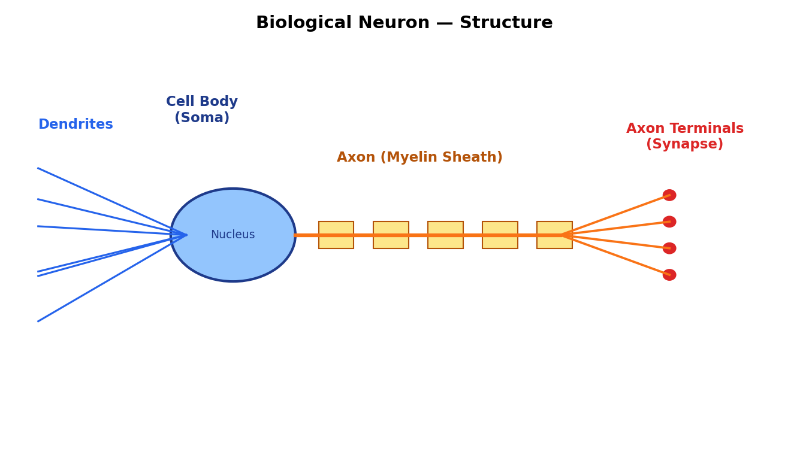
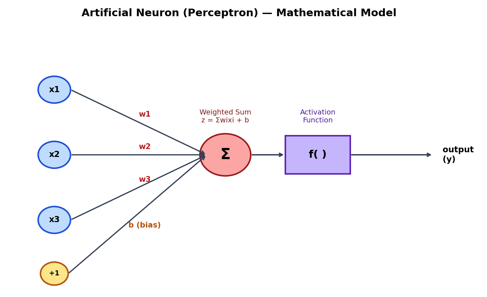
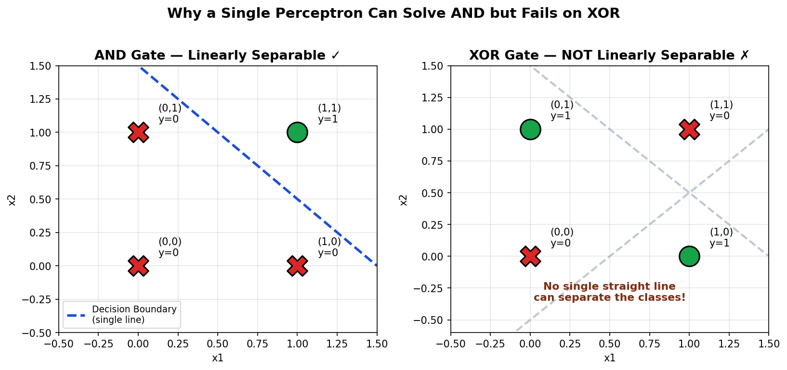
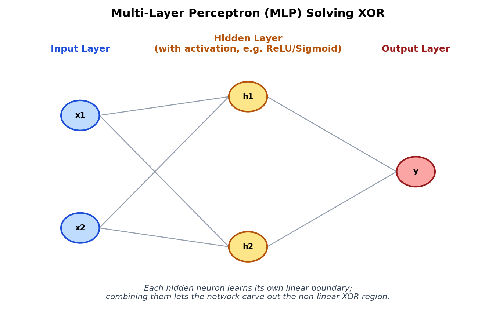
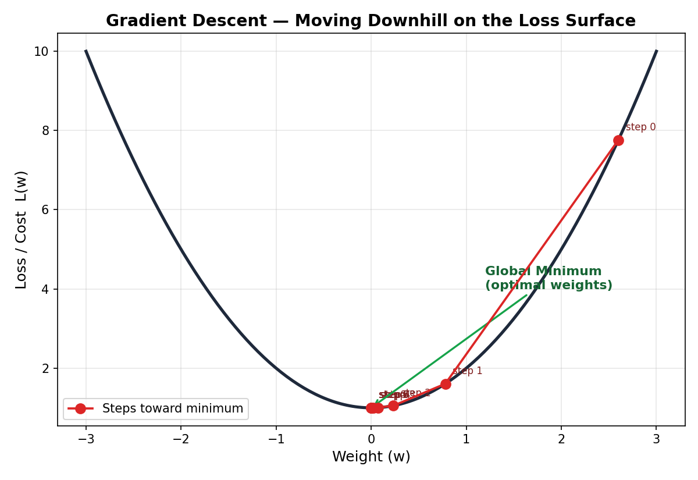
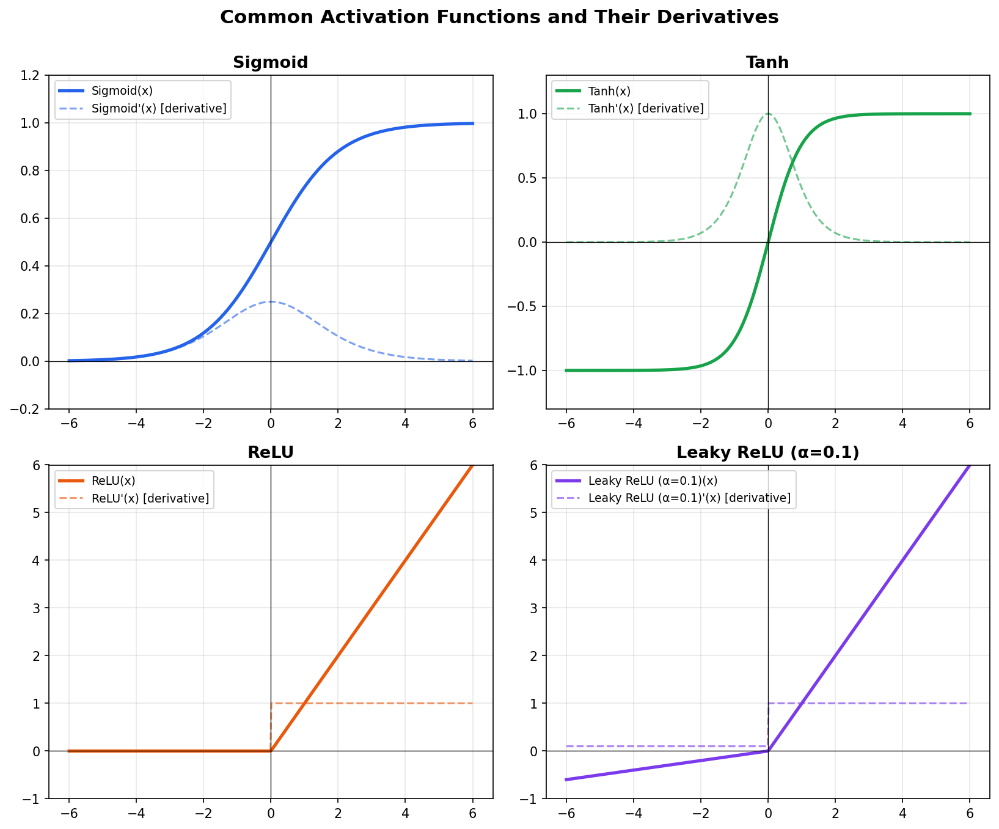
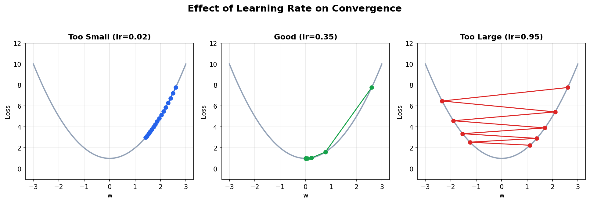

'''

- Name : Tejal Dadaji Pagar
- Cohort : AIML & TEP cohort 2026
- Day : Tuesday
- Date : 18/08/2026
- Description :This file covers basic of neurons,neural network ,xor example,gradient descent,loop functions,hyperparameter

'''

# Neural Networks

---

## 1. What is a Neuron?

A **neuron** is the basic unit of the human nervous system Billions of neurons in the brain connect to each other and pass electrical/chemical signals, allowing us to think, learn, and react

A biological neuron has four main parts:

| Part                         | Function                                             |
| ---------------------------- | ---------------------------------------------------- |
| **Dendrites**                | Receive signals from other neurons (like inputs)     |
| **Cell Body (Soma)**         | Processes the incoming signals                       |
| **Axon**                     | Carries the processed signal away from the cell body |
| **Axon Terminals / Synapse** | Passes the signal to the next neuron                 |



---

## 2. From Biological Neuron → Artificial Neuron

Researchers modeled this biological process mathematically, creating the **artificial neuron** (also called a **perceptron**), the building block of neural networks.

| Biological Neuron    | Artificial Neuron       |
| -------------------- | ----------------------- |
| Dendrites            | Inputs (x1, x2, x3...)  |
| Synaptic strength    | Weights (w1, w2, w3...) |
| Cell body processing | Weighted sum (Σ) + bias |
| Firing threshold     | Activation function     |
| Axon output          | Output (y)              |



**Mathematically:**

```
z = (w1*x1 + w2*x2 + w3*x3 + ... ) + b        (weighted sum)
y = f(z)                                       (activation function applied)
```

- `x` = inputs
- `w` = weights (importance given to each input)
- `b` = bias (shifts the decision boundary)
- `f` = activation function (decides whether/how strongly the neuron "fires")

A **single artificial neuron = a perceptron**, which can only solve simple problems. To solve complex ones, we connect many neurons in layers — this is a **Neural Network**.

---

## 3. How Neural Networks Emerged — The XOR Problem

### AND Gate (a simple logic problem)

| x1  | x2  | AND |
| --- | --- | --- |
| 0   | 0   | 0   |
| 0   | 1   | 0   |
| 1   | 0   | 0   |
| 1   | 1   | 1   |

A **single perceptron** can solve AND because you can draw **one straight line** that separates the `0`s from the `1`s.

### XOR Gate (exclusive OR)

| x1  | x2  | XOR |
| --- | --- | --- |
| 0   | 0   | 0   |
| 0   | 1   | 1   |
| 1   | 0   | 1   |
| 1   | 1   | 0   |

Here, the `1`s and `0`s are arranged **diagonally**. No single straight line can separate them.



### AND vs XOR — Key Comparison

| Aspect                         | AND                                      | XOR                                                                         |
| ------------------------------ | ---------------------------------------- | --------------------------------------------------------------------------- |
| Linearly separable?            | Yes ✓                                    | No ✗                                                                        |
| Solvable by single perceptron? | Yes                                      | No                                                                          |
| Decision boundary needed       | 1 straight line                          | Needs a curved/combined boundary                                            |
| Historical significance        | Proved perceptrons work for simple logic | Exposed the limitation of a single-layer perceptron (Minsky & Papert, 1969) |

### Why We Need a Neural Network for XOR

Since one straight line can't separate XOR's outputs, we need **multiple neurons working together in layers** (a **Multi-Layer Perceptron / MLP**):

- Each hidden neuron draws its own line (its own boundary).
- Combining several such lines lets the network build a **non-linear decision region**, which correctly separates XOR's outputs.
- This was the key discovery that led to modern deep neural networks: **stacking layers + non-linear activation functions = ability to solve non-linear problems.**



This is essentially _why neural networks exist_ — a single neuron is limited to linear problems; layers of neurons with non-linear activations let us model arbitrarily complex patterns.

---

## 4. Gradient Descent

Once a network has an architecture, it needs to **learn** the correct weights and biases. This is done using **Gradient Descent**, an optimization algorithm.

### The idea

1. The network makes a prediction.
2. We measure how wrong it is using a **loss function** (e.g., Mean Squared Error).
3. Gradient Descent tells us **which direction** to change each weight to reduce that loss.
4. We repeat this over and over until the loss is minimized.



### The formula

```
w_new = w_old − learning_rate × (∂Loss / ∂w)
```

- `∂Loss/∂w` is the **gradient** — it tells us the slope/direction of steepest increase in loss.
- We move in the **opposite** direction of the gradient (hence "descent") to reduce the loss.
- This is repeated for every weight in the network using **backpropagation**, which efficiently computes gradients layer-by-layer using the chain rule.

### How it works inside a Neural Network / Deep Learning

1. **Forward pass:** input flows through the network → prediction is made.
2. **Loss calculation:** compare prediction to actual value.
3. **Backward pass (Backpropagation):** gradients of the loss w.r.t. every weight are calculated using the chain rule, moving backward from output to input layers.
4. **Weight update:** every weight is nudged slightly using gradient descent.
5. Repeat for many iterations (**epochs**) until the loss is minimized.

This is exactly how a network "learns" the correct weights to solve problems like XOR.

---

## 5. Activation Functions

An **activation function** decides whether a neuron should "fire" and how strongly. Without it, stacking layers would be pointless — multiple linear layers collapse into a single linear function, so the network could never learn non-linear patterns like XOR.



### Types of Activation Functions

#### a) Sigmoid

```
f(x) = 1 / (1 + e^(-x))
```

- Squashes input to a range **(0, 1)**.
- Used in output layers for **binary classification** (probability-like output).
- **Drawback:** for very large/small `x`, the gradient becomes almost 0 ("vanishing gradient"), slowing down learning in deep networks.

#### b) Tanh (Hyperbolic Tangent)

```
f(x) = (e^x − e^-x) / (e^x + e^-x)
```

- Squashes input to range **(−1, 1)**, zero-centered (better than sigmoid for hidden layers).
- Still suffers from vanishing gradients at extreme values.

#### c) ReLU (Rectified Linear Unit)

```
f(x) = max(0, x)
```

- Outputs `x` if positive, else `0`.
- Most widely used in hidden layers of deep networks — fast to compute, reduces vanishing gradient problem.
- **Drawback:** "dying ReLU" — neurons stuck outputting 0 for negative inputs stop learning.

#### d) Leaky ReLU

```
f(x) = x        if x > 0
f(x) = α·x      if x ≤ 0    (α is a small constant, e.g. 0.01–0.1)
```

- Fixes dying ReLU by allowing a small, non-zero gradient when `x` is negative.

### Quick Comparison

| Activation | Range   | Common Use                           | Main Issue               |
| ---------- | ------- | ------------------------------------ | ------------------------ |
| Sigmoid    | (0, 1)  | Output layer (binary classification) | Vanishing gradient       |
| Tanh       | (−1, 1) | Hidden layers (older networks)       | Vanishing gradient       |
| ReLU       | [0, ∞)  | Hidden layers (most common today)    | Dying ReLU               |
| Leaky ReLU | (−∞, ∞) | Hidden layers, fixes dying ReLU      | Extra hyperparameter (α) |

---

## 6. Learning Rate

The **learning rate (lr)** is a hyperparameter that controls **how big a step** gradient descent takes toward the minimum loss

```
w_new = w_old − learning_rate × gradient

```

- **Too small:** the network learns very slowly, taking a huge number of steps/epochs to converge (or getting stuck).
- **Too large:** the network may overshoot the minimum, bounce around, or even diverge (loss increases instead of decreasing) ,wil also increase cost and time wastage will happen here
- **Good learning rate:** steady, efficient convergence to the minimum loss.



### Summary

| Learning Rate | Effect                                                                                             |
| ------------- | -------------------------------------------------------------------------------------------------- |
| Too small     | Very slow convergence, may get stuck before reaching minimum,also will increases cost,time wastage |
| Too large     | Overshoots minimum, unstable, may diverge,goes beyond the limit                                    |
| Well-tuned    | Fast, stable convergence                                                                           |

---

## The Big Picture

1. **Biological neuron** → inspired the **artificial neuron (perceptron)**.

2. A **single perceptron** can only solve **linearly separable** problems (like AND) — it fails on **XOR**.

3. Stacking neurons into **layers (a neural network)** with **non-linear activation functions** allows solving non-linear problems like XOR.

4. The network **learns** its weights using **gradient descent + backpropagation**, guided by a loss function.

5. **Activation functions** (Sigmoid, Tanh, ReLU, Leaky ReLU, etc.) introduce the non-linearity needed for deep learning to work.

6. The **learning rate** controls how fast/stable this learning process is.
