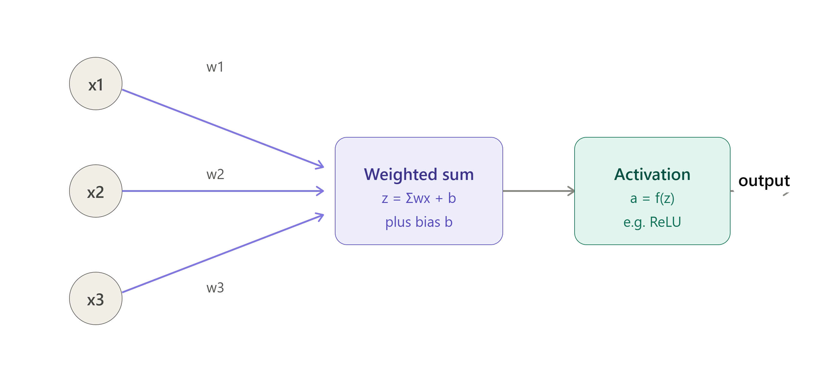
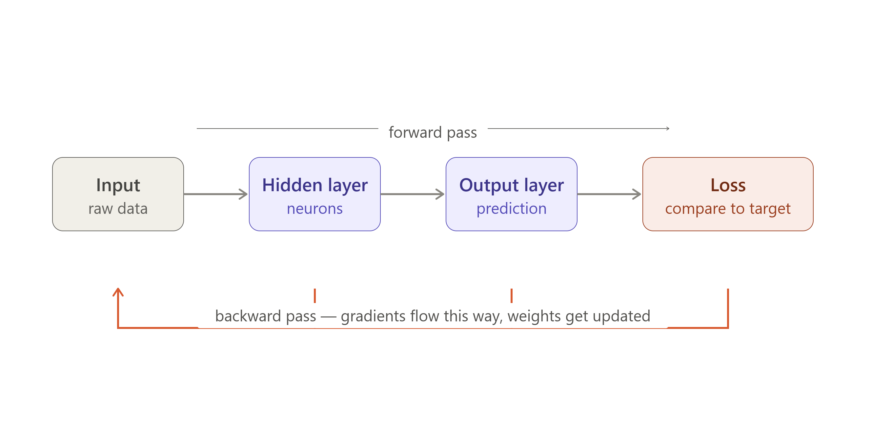
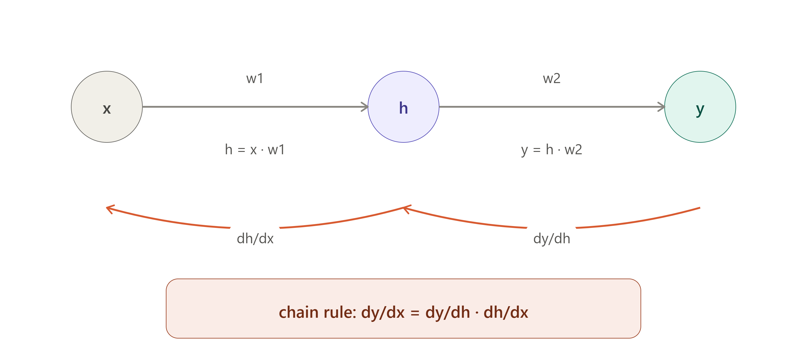

'''
- Name : Tejal Dadaji Pagar
- Cohort : AIML & TEP cohort 2026
- Day : Wednesday
- Date : 19/08/2026
- Description :This file covers forward pass,loss calculation ,back propogation,also hands on will be included in another file

'''

# DAY 10

---

# Neural Networks

## 1. What even is a neuron?

A neuron is just a tiny calculator. That's it. It does 3 things:

1. Takes some inputs (numbers)
2. Multiplies each one by a "weight" (basically: how much does this input matter) and adds them up, plus a little extra number called a bias
3. Passes that sum through an "activation function" which just reshapes the number a bit (like squashing it between 0 and 1, or chopping off negatives with ReLU)

So one neuron = `z = w1*x1 + w2*x2 + ... + b`, then `output = f(z) = Y`

Why bother with the activation function? Because without it, stacking a million neurons is still just... a straight line. Boring. The activation function is what lets the network learn curvy, complicated patterns instead of just straight lines.

## 2. Stack a bunch of neurons = a network

- **Input layer**: raw data goes in here
- **Hidden layer(s)**: the neurons doing the actual "thinking," transforming stuff step by step
- **Output layer**: spits out the final answer/prediction

Data flows forward, left to right basically: input → hidden layers → output. This is called the **forward pass**. Nothing complicated, just each neuron doing its little calculation and passing it along.

Once we get an output, we check "how wrong was it?" using a **loss function**. Just one number that tells us how bad the prediction was.



## 3. Backpropagation = how the network actually learns

Here's the deal: the network starts out random and dumb. Backprop is literally just the process of "okay we got it wrong, let's figure out exactly which weights are to blame, and nudge each one a little bit so we do better next time."

Two phases:

- **Forward pass** — like above, get a prediction and compute the loss
- **Backward pass** — send the error backward through the network, layer by layer, figuring out how much each weight contributed to the mistake

Then we update every weight a tiny bit in the direction that reduces the loss:

```
w_new = w_old - learning_rate * gradient
```

`learning_rate` is just how big a step we take. Too big = chaos. Too small = takes forever.

Repeat this loop (forward → loss → backward → update) a ton of times on lots of examples, and the weights slowly settle into values that actually work.



## 4. The chain rule — the actual math trick behind backprop

Remember the whiteboard example? `x → h → y`, where:

```
h = x * w1
y = h * w2
```

`x` doesn't affect `y` directly — it has to go through `h` first. So to know "how much does `y` change if I tweak `x`," you can't do it in one step. You gotta go through the middle:

```
dy/dx = (dy/dh) * (dh/dx)
```

Basically: multiply the "local" effects along the chain together.

- `dh/dx = w1` (bumping x by 1 bumps h by w1)
- `dy/dh = w2` (bumping h by 1 bumps y by w2)
- so `dy/dx = w1 * w2`

Quick sanity check with numbers: x=2, w1=3, w2=4 → h=6, y=24. Bump x to 3 → h=9, y=36. y jumped by 12. And w1*w2 = 3*4 = 12. Matches perfectly.



## 5. Why this chain rule thing matters for training

We don't actually care about `dy/dx`. We care about **how much the loss changes when we tweak a weight**, so we know which direction to adjust it. Same exact idea, just one extra link in the chain:

```
dLoss/dw1 = (dLoss/dy) * (dy/dh) * (dh/dw1)
```

Multiply all three pieces together, and boom — that tells us exactly how to adjust `w1` to make the loss smaller. Do this for every single weight in the network, and that's literally the entire backpropagation algorithm.

## TL;DR

- Neuron = weighted sum + squash it with an activation function
- Network = layers of neurons, data flows forward (forward pass)
- Loss = "how wrong were we"
- Backprop = send the error backward, using the chain rule to figure out each weight's blame
- Gradient descent = nudge every weight a bit to reduce the loss
- Repeat a ton of times = the network learns
